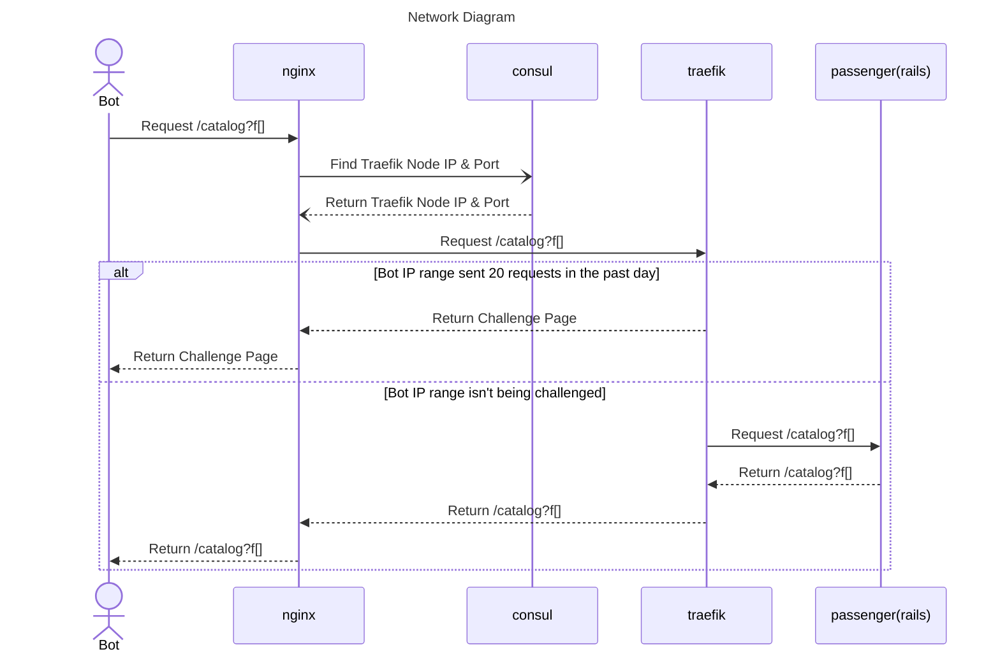

# Traefik Wall

This is a reverse proxy which sits between our load balancer and some of our applications and presents a Cloudflare Turnstile challenge to misbehaved bots.



## Add Traefik Bot Coverage to a website
- Edit `nomad/traefik-wall/deploy/sites/sites-<env>.yml`
  - add a new `router` entry for the website
  - add a new `service` entry for the website
- Edit `roles/nginxplus/files/conf/http/<site>.conf` (or `roles/nginxplus/files/conf/http/dev/<site>.conf` if the site runs on the dev/staging load balancers)
  - add a new `server` entry for `service.consul`
  - add a new `resolver` entry for nomad
  - confirm that all four `proxy_set_header` entries are included, add any that are missing
  ```
        proxy_set_header X-Forwarded-Host $host;
        proxy_set_header X-Forwarded-Proto https;
        proxy_set_header X-Real-IP $remote_addr;
        proxy_set_header X-Forwarded-For $remote_addr;
  ```
- Confirm that traffic is allowed from the LibNetPvt subnet to all VMs/machines on the firewall (only necessary for VMs with publicly routable IPs)
  - Update firewall rules if necessary
- Deploy the changes to the traefik-wall configuration to the correct environment as described in the Deployment section below.
- Confirm that it's working by visiting <sitename>.princeton.edu/challenge

## Deployment

From `nomad` directory: `BRANCH=main ./bin/deploy traefik-wall staging`

You can track progress and status of nomad apps by looking at the Nomad UI, accessible from `./bin/login`

## Tracking Challenges

You can track what challenges are happening by looking at our load balancer's logs for the `/challenge` route:

[Datadog Challenge Logs](https://app.datadoghq.com/logs?query=service%3Aadc%20%23challenged%3A%22%2Fchallenge%22&agg_m=count&agg_m_source=base&agg_t=count&calculated_fields=challenged%3Dsplit_before%28%40uri%5C%2C%22%3F%22%5C%2C0%29&clustering_pattern_field_path=%40uri&cols=host%2Cservice%2C%23challenged&fromUser=true&messageDisplay=inline&refresh_mode=sliding&storage=hot&stream_sort=desc&viz=stream&from_ts=1740689020346&to_ts=1740692620346&live=true)

You can see all requests that still get through to an application by looking at the Passenger logs in Datadog and filtering by service, removing health checks. Below is an example for Finding Aids.

[Datadog Passenger Logs](https://app.datadoghq.com/logs?query=source%3Anginx%20%40http.method%3AGET%20-%40http.useragent%3A%28%22nginx%2F1.29.3%20%28health%20check%29%22%20OR%20%22Go-http-client%2F1.1%22%20OR%20%22nginx%2F1.29.0%20%28health%20check%29%22%29%20service%3Apulfalight&agg_m=count&agg_m_source=base&agg_t=count&clustering_pattern_field_path=message&cols=host%2Cservice%2C%40http.url_details.path&fromUser=true&messageDisplay=inline&refresh_mode=sliding&storage=hot&stream_sort=desc&viz=stream&from_ts=1764259051801&to_ts=1764863851801&live=true)

You can track successful user turnstile challenges from the logs by finding all requests that hit passenger with a referer from `/challenge`:

[Datadog Challenge Success Logs](https://app.datadoghq.com/logs?query=source%3Anginx%20%40http.method%3AGET%20-%40http.useragent%3A%28%22nginx%2F1.27.2%20%28health%20check%29%22%20OR%20%22checkmk-active-httpv2%2F2.3.0%22%29%20challenge%20%23first_path_part%3A%22%2Fcatalo%22&agg_m=count&agg_m_source=base&agg_t=count&analyticsOptions=%5B%22line%22%2C%22dog_classic%22%2Cnull%2Cnull%2C%22value%22%5D&calculated_fields=first_path_part%3Dleft%28%40http.url_details.path%5C%2C7%29&clustering_pattern_field_path=message&cols=host%2Cservice%2C%23first_path_part&fromUser=true&messageDisplay=inline&refresh_mode=sliding&storage=hot&stream_sort=desc&viz=timeseries&from_ts=1741280267292&to_ts=1741366667292&live=true)

[Cloudflare](https://dash.cloudflare.com/login) also has some analytics if you log in, select "Turnstile" in the left menu, and then click "view analytics". You can see how many challenges were issued vs. solved, solution type, and token validation.

## When Bots Attack

In your load balancer nginx configuration for protected applications you'll see lines like:

```
server service.consul service=lowchallenge.traefik-wall-production resolve max_fails=0;
# server service.consul service=highchallenge.traefik-wall-production resolve max_fails=0;
```

If a site is under attack then you can uncomment the `highchallenge` line and comment the `lowchallenge`, reload the nginx config, and all visits will be challenged, effectively taking all bot traffic off the application servers.

## Troubleshooting

If everything is working, you should be able to visit the `/challenge` path for your application and see a cloudflare turnstile widget. If you don't get that, try some of these things:

- deploy traefik wall to nomad
- check the nginx configs to ensure they're pointing at the correct prod or staging traefik instance

Other things you can use to trace network connections:

- ensure the traefik box can reach the application box via curl (note you may need to install curl like `apk add curl` and include the X-Forwarded-Proto header) or wget
- ensure the load balancer can reach the application box (note we don't know how to do this right now)
- look at traefik logs in the nomad UI

## Cloudflare Configuration

To view and modify the Cloudflare Turnstile configuration you can log in to [Cloudflare](https://dash.cloudflare.com/login) using access information found in LastPass.

## Traefik middlewares

We're using 2 middlewares. `captcha-protect` protects anything that hits the `/catalog` route or a child thereof. `append-catalog-regex` redirects requests for facet values through the catalog route; you may need this one if you have facet requests coming through the root path like `my-site.princeton.edu/?f=[]`.

## How to allow a partner through the bot wall

Sometimes we have vendors that programmatically access our resources and we want to let them through. To do so there are two options:

1. **BEST** If they have a static IP range, represented by a CIDR (`x.x.x.x/yy`), then you can add them to exemptIps in the [production bot config](https://github.com/pulibrary/princeton_ansible/blob/main/nomad/traefik-wall/deploy/bot-plugin-production.tpl.yml#L18) and the [staging bot config](https://github.com/pulibrary/princeton_ansible/blob/main/nomad/traefik-wall/deploy/bot-plugin-staging.tpl.yml#L18), then deploy.

2. If all of their IPs come from the same domain (you run `nslookup` on their IPs and it resolves to something like `x.them.com`, you can add them to goodBots in the [production bot config](https://github.com/pulibrary/princeton_ansible/blob/main/nomad/traefik-wall/deploy/bot-plugin-production.tpl.yml#L12) and the [staging bot config](https://github.com/pulibrary/princeton_ansible/blob/main/nomad/traefik-wall/deploy/bot-plugin-staging.tpl.yml#L12).
    * **CAVEAT**: If they append parameters to their requests (like `/catalog/1234?auth_token=???`) their requests will still be blocked. If this is something we need to support we'll have to update the Traefik plugin.

3. We can have a separate path for the APIs they use that isn't related to `/catalog` or `/advanced` - this is the most expensive option, and should be avoided.

## Special Thanks

This implementation would only be possible with the support of [joecorall](https://github.com/joecorall) for developing [captcha-protect](https://github.com/libops/captcha-protect) and [jrochkind](https://github.com/jrochkind) for testing a similar implementation for Rails applications.

Thank you.
