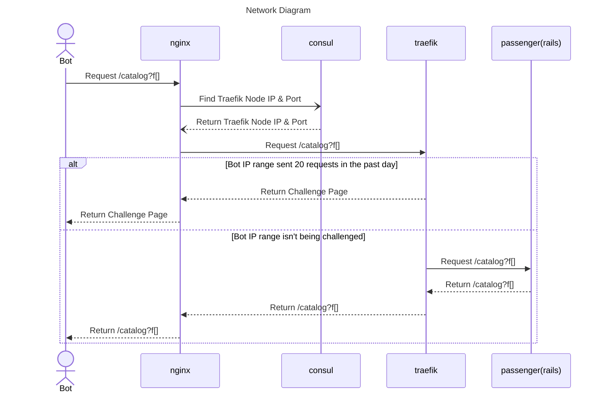

# Traefik Wall

This is a reverse proxy which sits between our load balancer and some of our applications and presents a Cloudflare Turnstile challenge to misbehaved bots.

## Deployment

From `nomad` directory: `BRANCH=main ./bin/deploy traefik-wall staging`

You can track progress and status of nomad apps by looking at the Nomad UI, accessible from `./bin/login`

## Tracking Challenges

You can track what challenges are happening by looking at our load balancer's logs for the `/challenge` route:

[Datadog](https://app.datadoghq.com/logs?query=service%3Aadc%20%23challenged%3A%22%2Fchallenge%22&agg_m=count&agg_m_source=base&agg_t=count&calculated_fields=challenged%3Dsplit_before%28%40uri%5C%2C%22%3F%22%5C%2C0%29&clustering_pattern_field_path=%40uri&cols=host%2Cservice%2C%23challenged&fromUser=true&messageDisplay=inline&refresh_mode=sliding&storage=hot&stream_sort=desc&viz=stream&from_ts=1740689020346&to_ts=1740692620346&live=true)

## When Bots Attack

TODO: Add documentation here about what to do when bots are causing significant downtime.

## Cloudflare Configuration

To view and modify the Cloudflare Turnstile configuration you can log in to [Cloudflare](https://dash.cloudflare.com/login) using access information found in LastPass.
