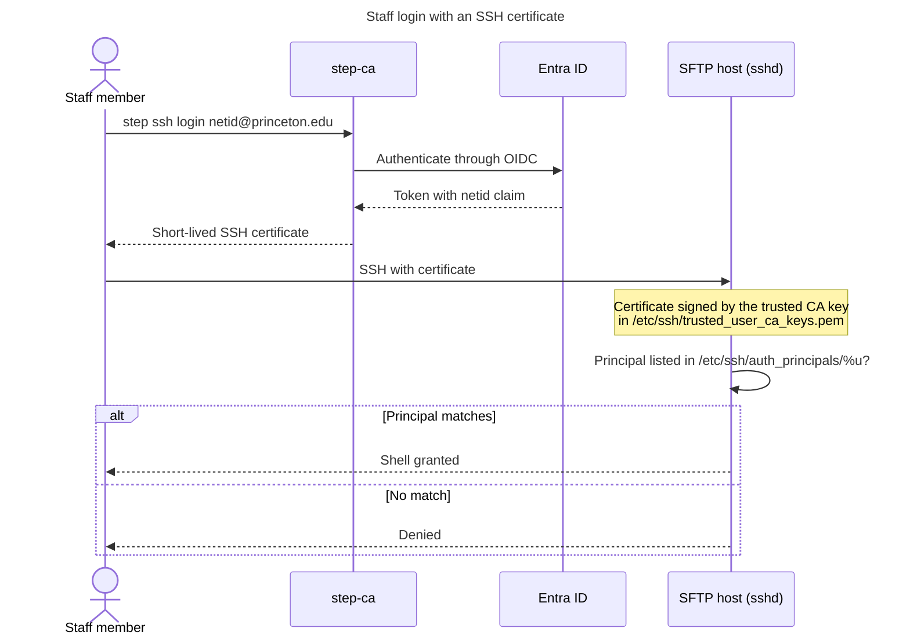
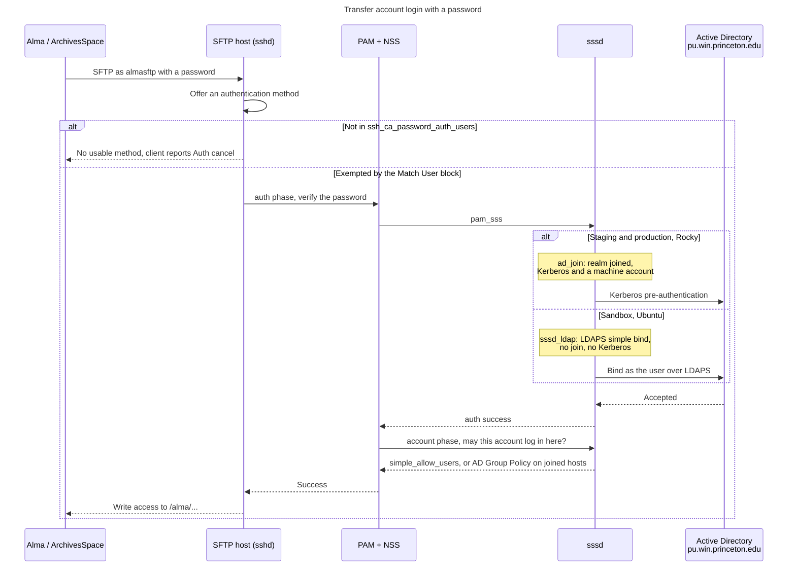
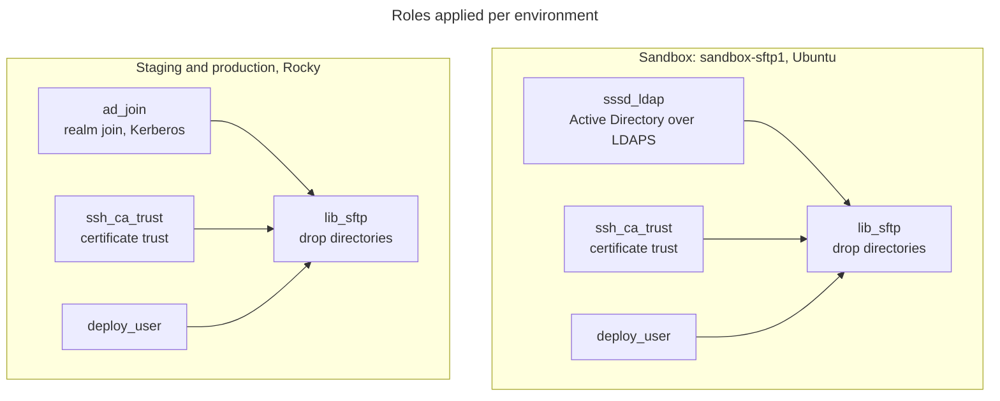

Authentication flow
===================

How a login on an SFTP host is authenticated, and why the same role produces two
different answers depending on the operating system.

Every account is a directory account. Neither this role nor `ssh_ca_trust`
creates a local Unix user or stores a password for the transfer accounts.

Who authenticates how
---------------------

| Login | Method | Verified by |
| --- | --- | --- |
| Staff (`pulsys`, netids) | SSH certificate | step-ca, which authenticates against Entra ID |
| `almasftp`, `lib-aspacesftp` | Password | Active Directory, through PAM and sssd |
| `deploy` | SSH public key | local `authorized_keys` |

The host default is `PasswordAuthentication no`. The two transfer accounts are
exempted by name through `ssh_ca_password_auth_users`, which `ssh_ca_trust`
renders as a `Match User` block. Everyone else needs a certificate or a key.

Staff certificate login
-----------------------



Transfer account password login
-------------------------------

Alma and ArchivesSpace push files with a password. They cannot run
`step ssh login` and cannot complete MFA, so Active Directory verifies the
password through PAM. How the host reaches Active Directory depends on the
operating system.

Entra ID is **not** usable for these accounts. Himmelblau forces MFA on every
remote session, so a password-only service account is refused with
`AADSTS50072 UserStrongAuthEnrollmentRequiredInterrupt` even when the password is
correct. Entra also exposes no LDAP interface, so it cannot be reached the way
Active Directory is below.



How the roles combine
---------------------



`lib_sftp` depends on `ssh_ca_trust` and `deploy_user`. The identity provider is
chosen in the playbook, because it is the one piece that differs:
`playbooks/lib_sftp.yml` adds `ad_join`, and `playbooks/sandbox_sftp.yml` adds
`sssd_ldap`.

Both reach the same Active Directory. `ad_join` performs a full realm join and
only runs on Rocky, because it needs `authselect-compat` and `krb5-workstation`,
neither of which exists in Ubuntu. `sssd_ldap` binds over LDAPS with no machine
account and no Kerberos, so it runs on either.

Ordering matters. The identity role has to run before `lib_sftp`, or NSS cannot
resolve the transfer accounts and the drop directories cannot be chowned to them.
`lib_sftp` asserts this up front so the failure names the cause.

Diagnosing a failure
--------------------

`playbooks/utils/sftp_auth_debug.yml` collects every check below in one pass:

```sh
ansible-playbook playbooks/utils/sftp_auth_debug.yml -e probe_hosts=libsftp_staging
```

An SSH login has **two** PAM phases, and testing only the first is the easiest
mistake to make:

```sh
sudo sssctl user-checks almasftp -s sshd -a auth   # is the password right?
sudo sssctl user-checks almasftp -s sshd -a acct   # may it log in here?
```

Read the client error carefully, because the two look alike and mean different
things:

| Client says | Meaning |
| --- | --- |
| `Auth fail` | the password was wrong |
| `Auth cancel` (JSch) | no acceptable method was offered, **or** the password was refused and the client had nothing left to try |
| `Permission denied (publickey,...)` | the listed methods are all the server offered |

Neither indicates a firewall problem: the connection already reached the
authentication stage.

Things that break this flow
---------------------------

- **A wrong password looks like a configuration fault.** `Preauthentication
  failed` in the sssd journal means the directory rejected the password. Compare
  its timestamp against `lastb` and the client's source address. This is what
  actually broke staging: the credential Alma held no longer matched.
- **Password and keyboard-interactive are separate methods.** An interactive
  `ssh` client uses either, so a successful human login proves nothing about an
  automated one. Rocky's `50-redhat.conf` ships
  `ChallengeResponseAuthentication no`, which disables keyboard-interactive
  host-wide. Enable both for these accounts.
- **Entra ID cannot serve password-only SSH.** Himmelblau pushes
  `AuthOption::ForceMFA` for any remote service, and no option changes it.
- **`AllowUsers` accumulates; scalar keywords do not.** Every `AllowUsers` line
  across `sshd_config` and every drop-in is appended to one list. But
  `PasswordAuthentication` and similar take the **first** value parsed, so an
  earlier-sorting drop-in wins. A `Match` block overrides the global value for
  matching connections regardless of which file it is in.
- **Directory accounts have no local group membership.** `usermod` cannot modify
  an account absent from `/etc/passwd`, so `lib_sftp_group_members` stays empty
  and access comes from directory ownership. `pusvc-g` (gid 20204) arrives from
  Active Directory as their primary group.
- **`ldap_id_mapping` must stay false.** UIDs come from the directory's
  `uidNumber`, so they match the realm-joined hosts. An account missing that
  attribute will not resolve at all.
- **LDAPS is required for `sssd_ldap`.** Authentication is a simple bind, so the
  password crosses the network; the role refuses to run otherwise.
