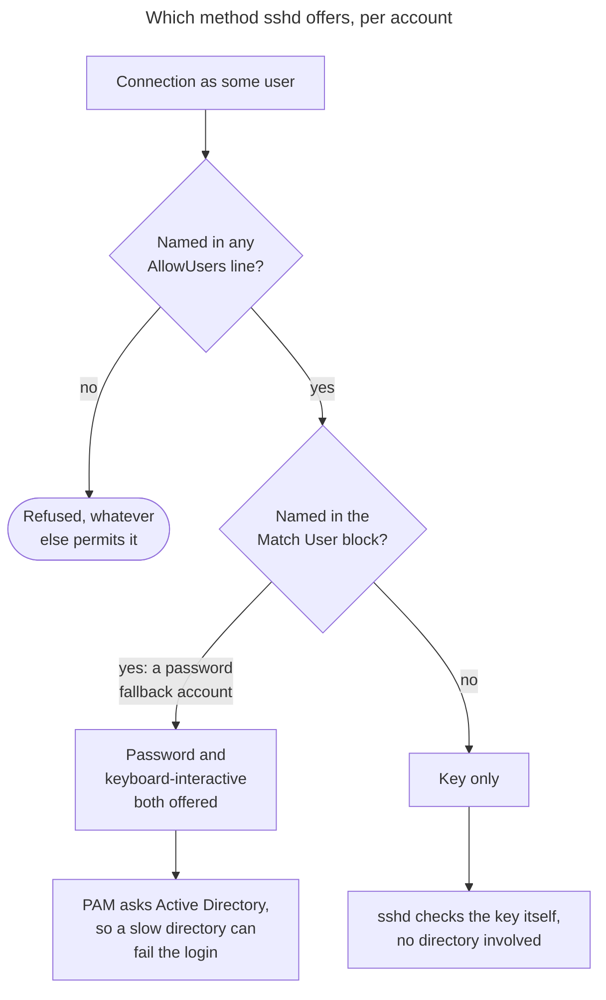
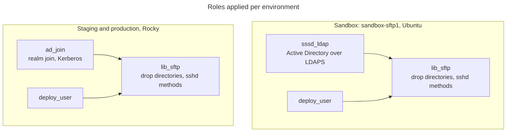

Authentication flow
===================

How a login on an SFTP host is authenticated, and which role owns which part.

The transfer accounts are **directory accounts**. This role does not create them
and does not store their passwords; it makes sure sshd offers them a method they
can actually use, and that the drop directories belong to them.

Who authenticates how
---------------------

| Login | Method | Verified by |
| --- | --- | --- |
| `almasftp`, `lib-aspacesftp` on the sandbox | SSH public key | sshd, from `/etc/ssh/authorized_keys.d/%u` |
| `almasftp`, `lib-aspacesftp` on staging and production | Password | Active Directory, through PAM |
| `pulsys`, `deploy` | SSH public key | local `~/.ssh/authorized_keys` |

A key is preferred wherever the partner can be configured for one. sshd checks
it itself, so the login does not depend on the directory answering, there is no
credential to rotate, and multi-factor policies do not apply. Staging and
production still use a password because that is what Alma and ArchivesSpace send
today; changing them needs the integration profile at each partner changed
first.

For how Active Directory resolves and authenticates the two transfer accounts,
see [the sssd_ldap authentication flow](../sssd_ldap/AUTH_FLOW.md). This document
covers only the SFTP host itself.

What sshd is asked to allow
---------------------------

The role writes one drop-in covering exactly what its accounts need: a key where
the partner can manage one, a password only where it cannot, and the account
names added to `AllowUsers` either way.



Two details in that diagram cause most real failures.

**`AllowUsers` is a veto.** It accumulates across every `sshd_config.d` file
rather than the first one winning, but if any `AllowUsers` exists anywhere, an
account named in none of them is refused however else it is permitted. The
transfer accounts are therefore listed explicitly, alongside `pulsys` and the
deploy user so the role can never lock out administrative access.

**Password and keyboard-interactive are separate methods.** Where a password is
still in use, both are enabled. An interactive `ssh` client quietly uses either,
so a successful human login proves nothing about an automated one: Alma drives
transfers with a Java library that may negotiate only one, and Rocky's stock
`50-redhat.conf` ships `ChallengeResponseAuthentication no`, which disables
keyboard-interactive host-wide.

**Keys live outside the accounts' homes.** These are directory accounts whose
home is only created on first login, so a key kept in the home could not be read
on the very first connection. They go in a root-owned
`/etc/ssh/authorized_keys.d/%u` instead. The default location is kept **first**
in `AuthorizedKeysFile`: replacing it rather than adding to it would lock out
every account that does keep a key in its own home, `pulsys` included.

How the roles combine
---------------------



`lib_sftp` depends only on `deploy_user`. The identity provider is chosen in the
playbook, because it is the one piece that differs by operating system:
`playbooks/lib_sftp.yml` adds `ad_join`, and `playbooks/sandbox_sftp.yml` adds
`sssd_ldap`. Both reach the same Active Directory.

Ordering matters. The identity role has to run first, or NSS cannot resolve the
transfer accounts and the drop directories cannot be chowned to them. The role
asserts this up front so the failure names the cause instead of surfacing later
as an ownership error.

Diagnosing a failure
--------------------

```sh
ansible-playbook playbooks/utils/sftp_auth_debug.yml -e probe_hosts=libsftp_staging
```

The single most useful command is to ask sshd what a real login would get,
because it resolves every drop-in and `Match` block:

```sh
sudo sshd -T -C user=almasftp,host=alma.exlibrisgroup.com,addr=1.2.3.4 \
  | grep -iE 'passwordauth|kbdinteractive|allowusers'
```

Then force each method separately, since an automated client may only use one:

```sh
ssh -o PreferredAuthentications=password almasftp@thehost
ssh -o PreferredAuthentications=keyboard-interactive almasftp@thehost
```

Read the client error carefully. The two look alike and mean different things:

| Client says | Meaning |
| --- | --- |
| `Auth fail` | the password was wrong |
| `Auth cancel` (JSch) | no acceptable method was offered, **or** the password was refused and the client had nothing left to try |
| `Permission denied (publickey,...)` | the listed methods are all the server offered |

Neither indicates a firewall problem: the connection already reached the
authentication stage. A wrong password appears in the sssd journal as
`Preauthentication failed`; compare its timestamp against `lastb` and the
client's source address. That is what actually broke staging.
