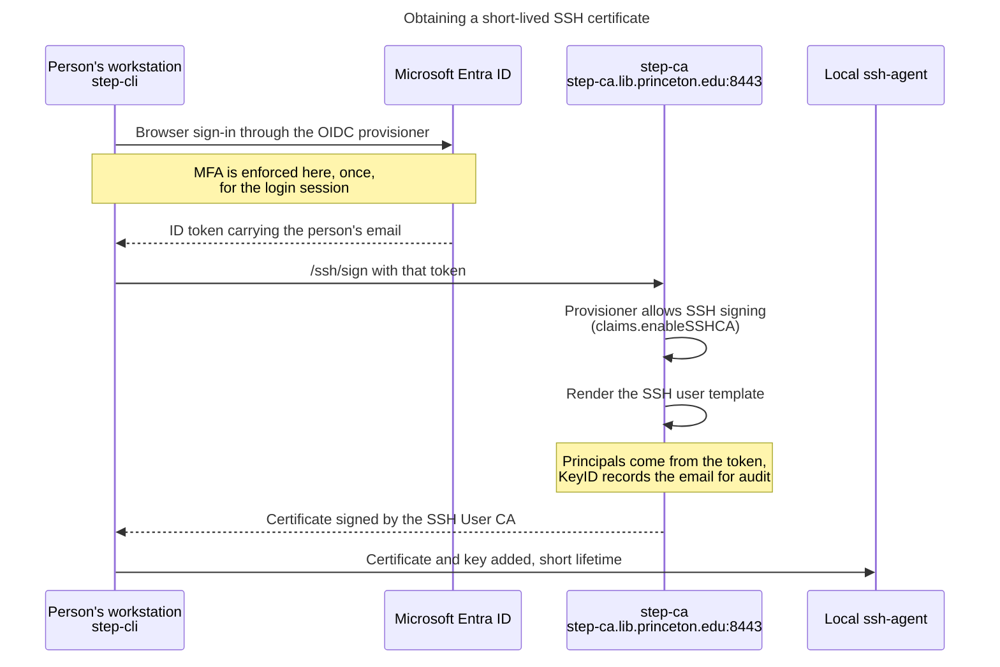
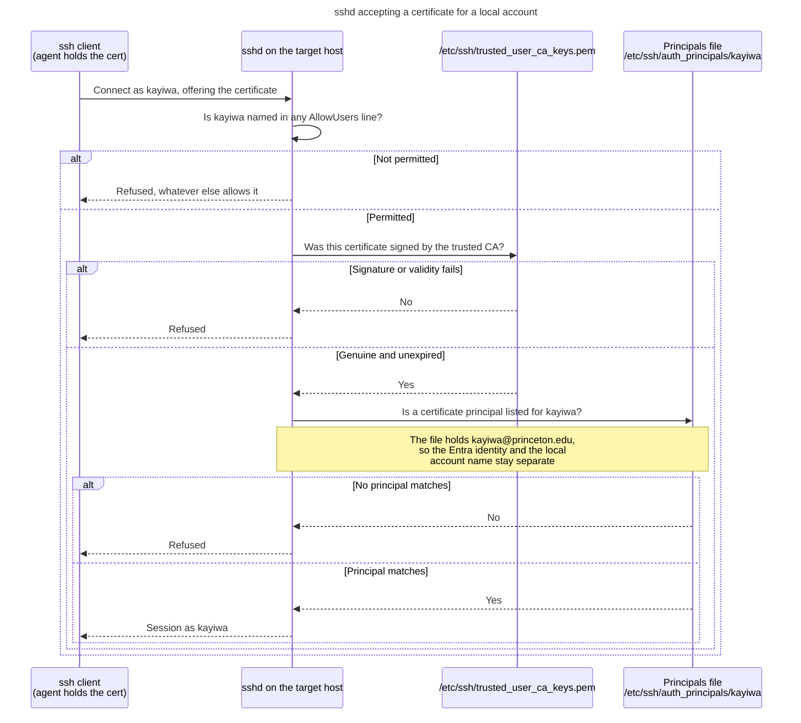
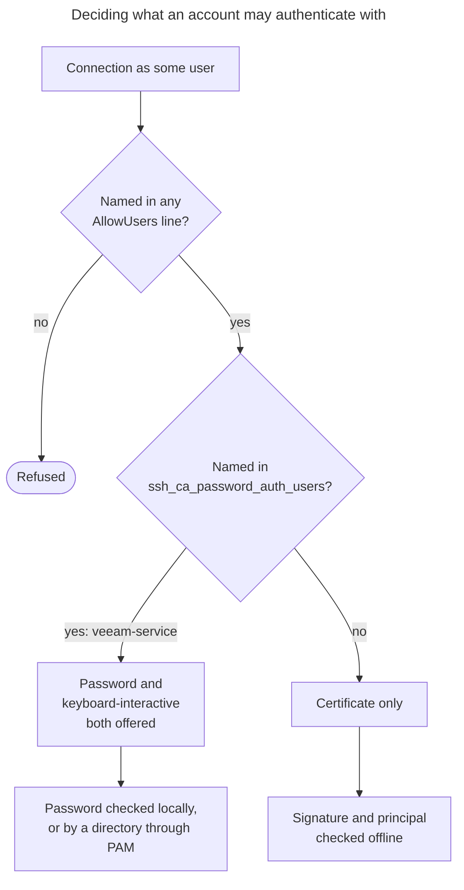
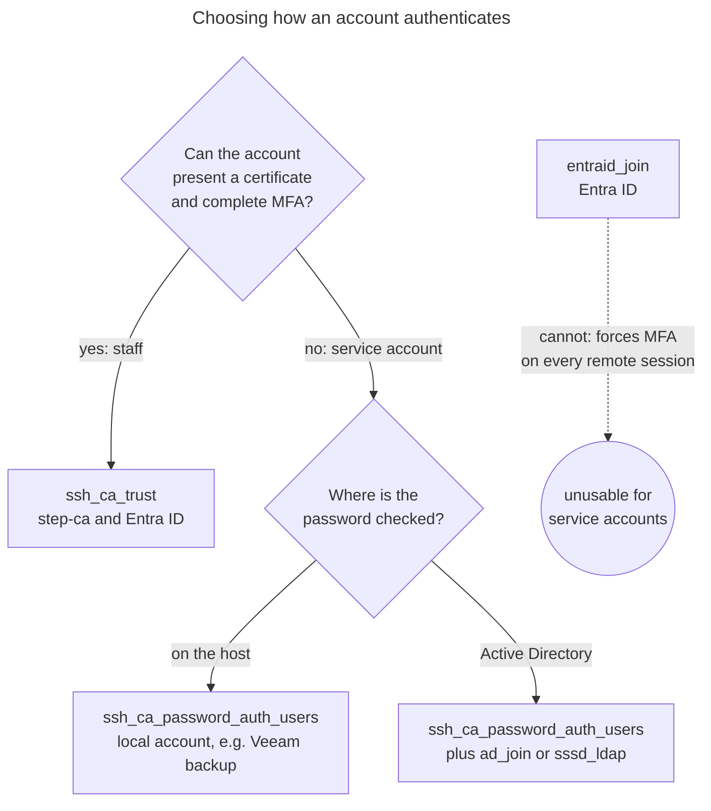

Authentication flow
===================

How a person logs in to a host configured by this role, and which part of the
system decides what.

Nothing on the host talks to step-ca or to Entra ID. The host is a relying party
that trusts one static public key, so it keeps working while the CA is
unreachable, and revoking a person's Entra access stops new logins without any
change here.

Three separate questions
------------------------

A certificate login is three independent checks, and confusing them makes
failures hard to read.

| Question | Decided by | Configured by |
| --- | --- | --- |
| Is this certificate genuine? | `TrustedUserCAKeys` | this role |
| Does its principal map to this account? | `AuthorizedPrincipalsFile` | this role |
| May this account log in at all? | `AllowUsers` and the auth methods offered | this role, plus the host image |

A genuine certificate is still refused if its principal is not listed for the
account it asks for, or if the account is missing from `AllowUsers`. All three
look the same from the client.

Getting a certificate
---------------------

The person runs `step ssh login` on their own workstation. That is the only step
where Entra ID is involved, and it happens nowhere near the target host.



The certificate is the credential from here on. It expires on its own, which is
the point: there is no long-lived personal key on any host to go stale.

Logging in to the host
----------------------



The host never contacts the CA during this exchange. Verification is offline
against the trusted public key, which is why the fingerprint assertion in the
role matters: install the wrong CA key and every login is refused, or worse, the
wrong one is accepted.

Which method sshd offers, per account
-------------------------------------

The drop-in sets `PasswordAuthentication no` for the host. Service accounts that
cannot present a certificate are named in `ssh_ca_password_auth_users` and get
passwords back inside a `Match User` block.



Two details in that diagram cause most real failures.

**`AllowUsers` is a veto.** It accumulates across `sshd_config` and every
`sshd_config.d` drop-in rather than the first one winning, but if any
`AllowUsers` exists anywhere, an account named in none of them is refused
however else it is permitted. The role therefore folds
`ssh_ca_password_auth_users` into the list it writes, so enabling a password for
a service account cannot be undone by an `AllowUsers` line that predates it.

**Scalar keywords behave the opposite way.** `PasswordAuthentication`,
`KbdInteractiveAuthentication` and friends take the **first** value parsed, and
`Include /etc/ssh/sshd_config.d/*.conf` sits at the top of the file on Debian
and RHEL alike. A drop-in that sorts earlier wins outright, which is why
`60-ssh-ca-access.conf` beats anything set later in `sshd_config`, and why the
`Match` block is the only correct way to make an exception. Flipping
`ssh_ca_disable_password_auth` to `false` would reopen passwords for everyone.

The trailing `Match all` closes the conditional context. Without it, any
directive parsed after this include would silently apply only to the matched
accounts.

Where each identity source fits
-------------------------------



Entra ID is not an option for password-only service accounts: Himmelblau forces
MFA for every remote session, so the login fails even with the correct password.
That is the whole reason `ssh_ca_password_auth_users` exists rather than a
second identity role. For how Active Directory resolves and authenticates such
accounts, see [the sssd_ldap authentication flow](../sssd_ldap/AUTH_FLOW.md).

Reading a failure
-----------------

Ask sshd what it actually decided for one account, rather than reading the
files:

```sh
sudo sshd -T -C user=kayiwa,host=$(hostname -f),addr=127.0.0.1 \
  | grep -iE 'trustedusercakeys|authorizedprincipalsfile|allowusers|passwordauthentication|kbdinteractive'
```

Then confirm the two host-side inputs:

```sh
sudo ssh-keygen -lf /etc/ssh/trusted_user_ca_keys.pem   # matches the CA?
sudo cat /etc/ssh/auth_principals/kayiwa                # principal listed?
ssh-add -L | ssh-keygen -Lf -                           # what the client holds
```

| Symptom | Usual cause |
| --- | --- |
| `Permission denied (publickey)` with a valid cert | principal missing from `/etc/ssh/auth_principals/<user>` |
| Works for one account, not another | the second account is absent from an `AllowUsers` line |
| Every certificate refused | wrong or truncated CA key in `trusted_user_ca_keys.pem` |
| Was working, now refused | certificate expired; run `step ssh login` again |
| Service account prompts, then fails | password is checked by Entra, which requires MFA |
