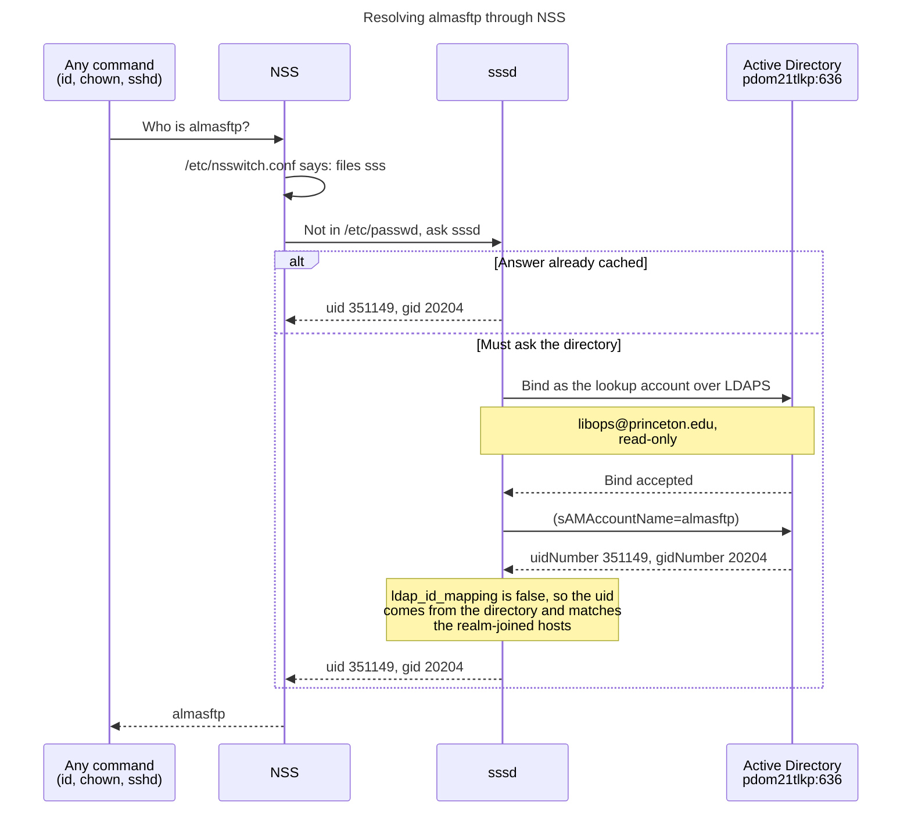
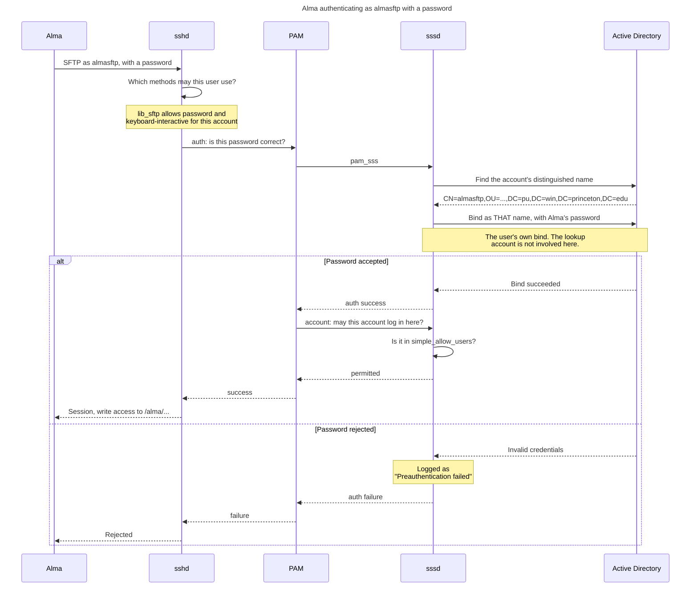
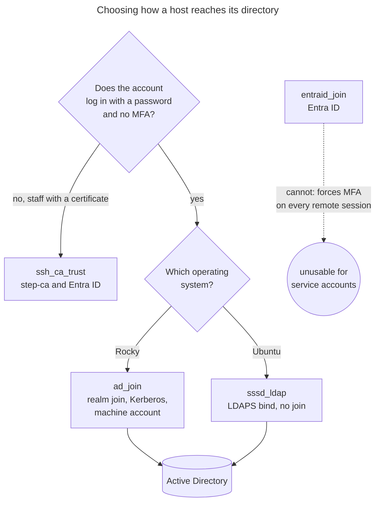

Authentication flow
===================

How `almasftp` and `lib-aspacesftp` are resolved and authenticated on a host
configured by this role.

Both are **Active Directory accounts**. Nothing on the host creates them, and no
password is stored locally. The host is not joined to the domain: it is an
ordinary LDAP client that binds over TLS.

The accounts
------------

| | `almasftp` | `lib-aspacesftp` |
| --- | --- | --- |
| uid | 351149 | 354336 |
| gid | 20204 (`pusvc-g`) | 20204 (`pusvc-g`) |
| Login name | `almasftp@princeton.edu` | `lib-aspacesftp@princeton.edu` |
| Used by | Alma | ArchivesSpace |

Both live in
`OU=Library - Office of the Deputy University Librarian,OU=People,DC=pu,DC=win,DC=princeton,DC=edu`.

Note that the **login suffix is not the domain name**. The accounts are in
`pu.win.princeton.edu`, but the directory publishes their login names as
`name@princeton.edu`. Deriving one from the other produces a name that does not
exist, so `sssd_ldap_upn_suffix` is configured separately.

Two separate questions
----------------------

A login asks the directory two independent things, and confusing them makes
failures hard to read:

| Question | Mechanism | Uses |
| --- | --- | --- |
| Who is this account? | NSS lookup | the **lookup account**, `libops` |
| Is this password right? | PAM authentication | the **user's own** credentials |

Resolving an account and authenticating it are different binds. A working
`getent passwd` proves only the first.

Resolving the account
---------------------



If this fails, every later step fails with `no such user`, whatever the real
cause. That is why the role tests the connection, the lookup account and the
accounts themselves before writing any configuration.

Authenticating the account
--------------------------



The account phase is separate from the password. An account whose password is
correct can still be refused there, which looks identical from the client. Test
both:

```sh
sudo sssctl user-checks almasftp -s sshd -a auth   # is the password right?
sudo sssctl user-checks almasftp -s sshd -a acct   # may it log in here?
```

Why not Kerberos, and why not Entra
-----------------------------------



`ad_join` needs `authselect-compat` and `krb5-workstation`, which Ubuntu does
not package, so it cannot run on the sandbox. This role reaches the same
directory with no machine account, no keytab and no Kerberos, so a single
configuration works on both operating systems.

Entra ID is not an option for these two accounts. Himmelblau forces MFA for
every remote session, so a password-only service account is refused with
`AADSTS50072` even when the password is correct. Entra also exposes no LDAP
interface.

Reading a failure
-----------------

### Misleading messages in the SSH log

One failure in the account phase is reported by several components at once, and
only one of them is authoritative. From a real failure on the sandbox:

```text
pam_sss(sshd:auth): authentication success            <- the password was fine
pam_sss(sshd:account): Access denied ... 4 (System error)
error: PAM: User account has expired for almasftp
fatal: monitor_read: unpermitted request 104
```

Read those as **one** event, not four:

| Line | What it actually means |
| --- | --- |
| `pam_sss ... 4 (System error)` | **the authoritative one.** sssd could not answer. A genuine policy refusal is `6 (Permission denied)`. |
| `PAM: User account has expired` | sshd reporting whatever the PAM stack returned once `pam_sss` had failed. **Not literally true.** Check the directory before believing it. |
| `monitor_read: unpermitted request 104` | sshd's privilege-separated monitor rejecting a request from its child after the conversation had already broken. A downstream symptom. |

The expiry message is the dangerous one: specific, plausible and wrong.
`playbooks/utils/ad_account_lookup.yml` reports `userAccountControl` for each
account, and `66048` means enabled with a non-expiring password, so any
"expired" message on these accounts is a misreport.

Note also that the auth phase can succeed while the account phase fails moments
later. Cached credentials satisfy the password check without the directory, so a
working password proves nothing about whether sssd is currently healthy.

### The gap between the lines is the clue

A stall shows up as elapsed time. On the sandbox the account phase failed **24
seconds** after its own auth succeeded, far longer than any configured LDAP
timeout, so the query was not merely slow: the back end was wedged or
restarting. Compare the timestamps before assuming a policy decision was made
at all.

### Active Directory sub-codes

Active Directory returns the same "invalid credentials" for many different
problems and hides the real reason in a numeric sub-code. The role decodes
these, but when checking by hand:

| Sub-code | Meaning |
| --- | --- |
| `data 525` | no such account, or a distinguished name that cannot resolve |
| `data 52e` | the password was rejected |
| `data 530` / `531` | not permitted at this time, or from this host |
| `data 532` / `533` | password expired, or account disabled |
| `data 701` / `775` | account expired, or locked out |

`data 52e` is the trap: Active Directory also returns it for a name it cannot
resolve, so a wrong container or domain looks exactly like a wrong password.
Confirm the name before suspecting the credential:

```sh
ansible-playbook playbooks/utils/ad_account_lookup.yml \
  -e 'lookup_names=libops,almasftp,lib-aspacesftp'
```

That reads each account's authoritative name from the directory using a joined
host's own credentials, and prints the exact value to store.
