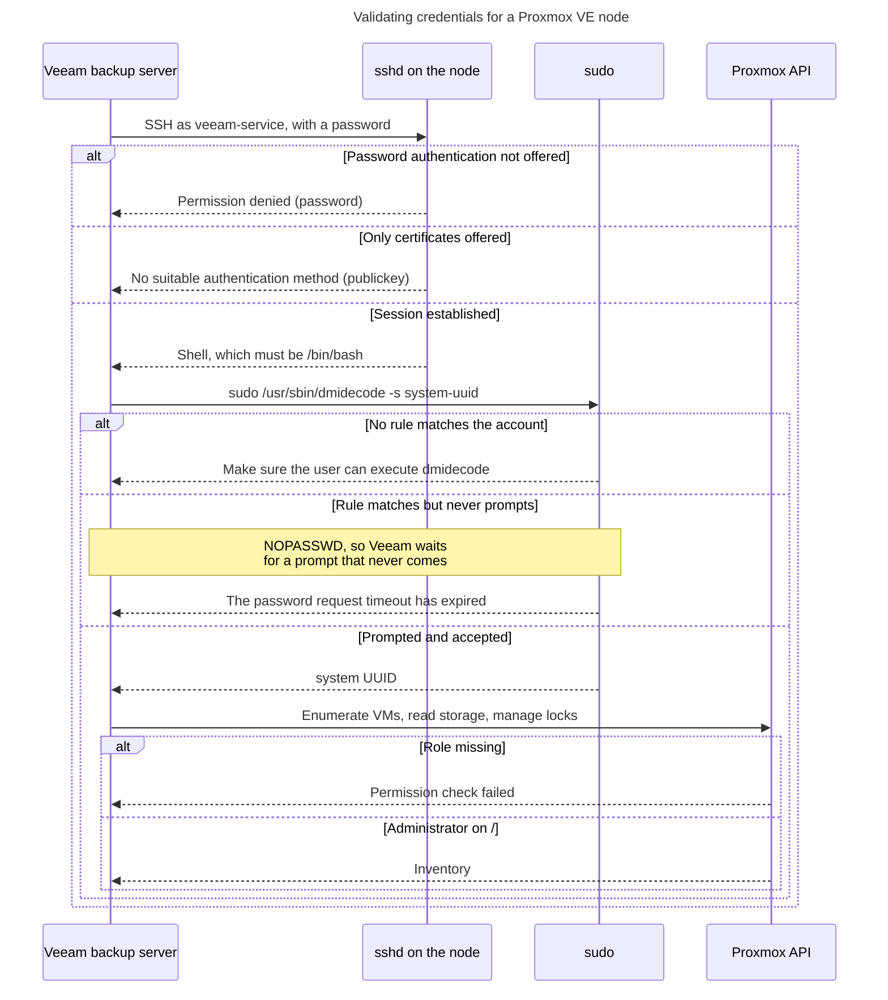
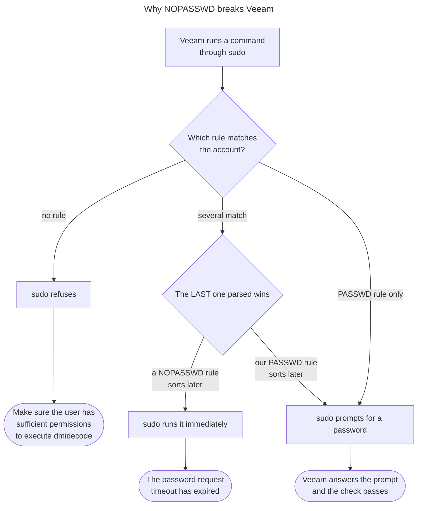
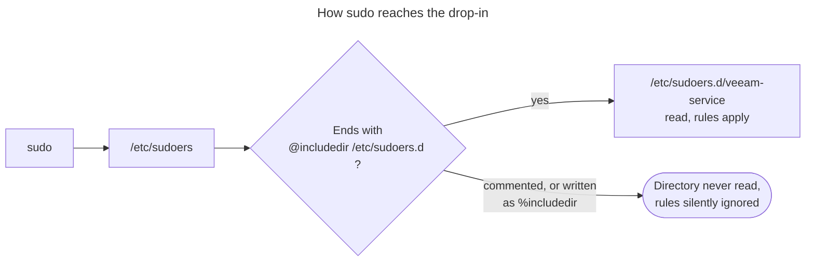
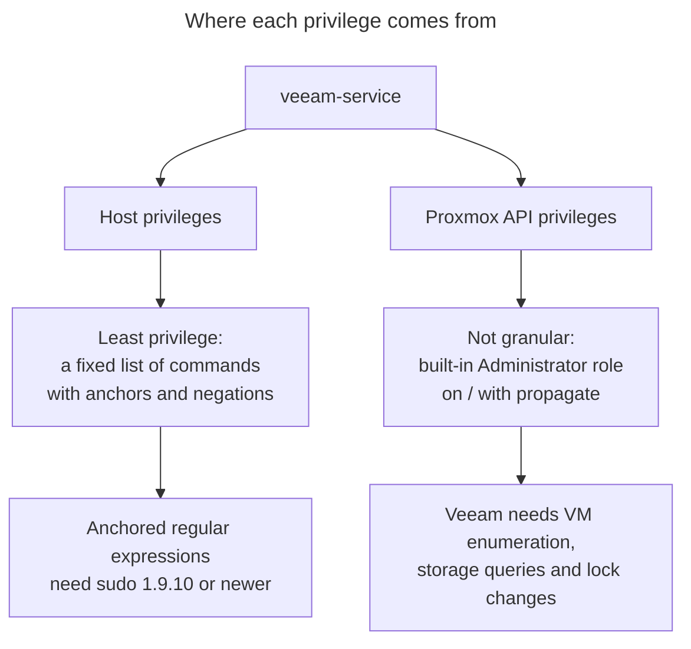

Authentication flow
===================

How Veeam Backup & Replication authenticates to a Proxmox VE node as a non-root
service account, and which layer produces which error message.

Adding a Proxmox node looks like one credential check in the console, but it is
four in a row: SSH, then sudo, then the specific command, then the Proxmox API.
Each failure surfaces as a different message, and none of them names the layer
that actually failed. That is what makes this integration hard to debug.

Who owns which layer
--------------------

| Layer | Question | Configured by |
| --- | --- | --- |
| SSH | May this account log in with a password? | `ssh_ca_trust` |
| sudo | May it run this exact command as root? | `veeam_proxmox` |
| sudo | Will it be asked for a password? | `veeam_proxmox` |
| Proxmox API | May it enumerate and lock VMs? | `veeam_proxmox` |

What the console is actually doing
---------------------------------



Every branch on the left is a different fix. Reading the message as a password
problem, when three of the four failures have nothing to do with the password,
is the usual wrong turn.

Why the sudo rules must prompt
------------------------------

Veeam sends the account password to each `sudo` call. If `sudo` is configured
not to ask, Veeam waits for a prompt that never arrives and gives up.



This is a live hazard on our nodes, because the operators group is granted
blanket `NOPASSWD` sudo, so an account in that group inherits it. That applies
whether the group is the account's primary group or a supplementary one, and the
two are fixed differently: clearing the supplementary list cannot move an account
out of its primary group.

Note the middle branch: when several rules match, sudo applies the **last** one
parsed, and `/etc/sudoers.d` is read in lexical order. `opsys` sorts before
`veeam-service`, so the explicit `PASSWD` rule currently wins and the prompt
still happens even for an account in that group. Rename either file, or add a
group rule that sorts later, and the behaviour flips with no visible change to
either file.

So reading the rules tells you very little. The role gives the account a group of
its own, clears its supplementary groups, removes superseded drop-ins, then asks
sudo what it would really do:

```sh
runuser -u veeam-service -- sudo -n /usr/sbin/dmidecode -s system-uuid
```

A **non-zero** exit is the healthy answer: sudo demanded a password, which is
exactly what Veeam supplies. Exit zero means the command ran unprompted, and
Veeam will hang waiting for a prompt.

Why a granted rule can still be invisible
-----------------------------------------

The rules live in a drop-in under `/etc/sudoers.d`, which `sudo` reads only
because `/etc/sudoers` ends with an include line. If that line is commented out,
missing, or mistyped, every rule in the directory is silently ignored and the
account looks as though it was never granted anything.



`%includedir` instead of `@includedir` is a common transcription slip and
produces exactly the "cannot execute dmidecode" error, with a drop-in that looks
perfectly correct on inspection. The role normalises this line.

Two privilege models, not one
-----------------------------



The granular model applies to the host only. Veeam has not made the API side
granular, so narrowing the Proxmox role below `Administrator` breaks inventory
and snapshot operations rather than tightening anything useful.

Reading a failure
-----------------

Work up the stack, in this order. Each command isolates one layer.

```sh
# 1. Does sshd offer this account a password at all?
sudo sshd -T -C user=veeam-service,host=$(hostname -f),addr=127.0.0.1 \
  | grep -iE 'passwordauthentication|kbdinteractive|allowusers'

# 2. Would sudo run something with no prompt? Non-zero here is the healthy
#    answer. Do not just grep the rules: when several match, the last one
#    parsed wins, so which file sorts later decides the outcome.
runuser -u veeam-service -- sudo -n /usr/sbin/dmidecode -s system-uuid; echo $?
id -gn veeam-service                    # primary group, often the real culprit
id -nG veeam-service                    # in a group with NOPASSWD sudo?

# 3. Is the exact command permitted?
sudo -l -U veeam-service /usr/sbin/dmidecode -s system-uuid

# 4. Does it work as the account itself, prompting for the password?
su - veeam-service -c 'sudo /usr/sbin/dmidecode -s system-uuid'

# 5. Does Proxmox know the account, with the right role?
pveum user list
pveum acl list
```

| Console message | Layer | Usual cause |
| --- | --- | --- |
| `Permission denied (password)` | SSH | password authentication is off for this account |
| `No suitable authentication method found (publickey)` | SSH | the host offers certificates only |
| `The password request timeout has expired` | sudo | a `NOPASSWD` rule won, or `sudo` is not installed |
| `Make sure the specified user has sufficient permissions to execute dmidecode` | sudo | the drop-in is not being read, or `dmidecode` is not installed |
| One node misbehaves, its peers are fine | sudo | that node's account was made by hand, often with a shared primary group |
| The managed drop-in looks correct but has no effect | sudo | a leftover file such as `veeam-service-bk` sorts later and wins |
| Inventory is empty, or snapshots fail | Proxmox API | the account lacks `Administrator` on `/` |

Step 4 is the one worth running by hand: it is the only check that exercises the
password, the prompt, and the rule together, exactly as Veeam does.

Reference
---------

- [Veeam KB4701](https://www.veeam.com/kb4701) — the authoritative command list.
  It is specific to the plug-in version, so re-check it after an upgrade.
